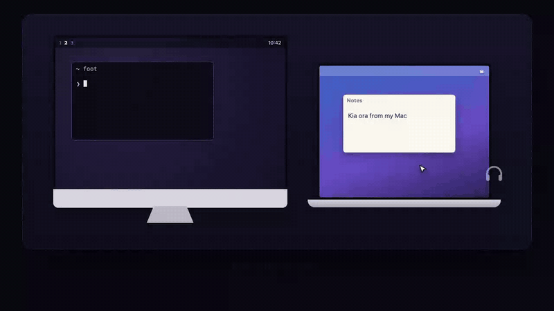

<p align="center">
  
</p>

<h1 align="center">Kiore</h1>

<p align="center">
  <strong>One mouse. Every computer.</strong><br>
  Push your cursor off the edge of your Mac's screen and keep going, onto the computer beside it.<br>
  Your keyboard, clipboard and sound come too.
</p>

<p align="center">
  <a href="https://galengreen.github.io/kiore/">Website</a> ·
  <a href="https://github.com/galengreen/kiore/releases/latest">Download</a> ·
  <a href="docs/DESIGN.md">How it works</a>
</p>

<p align="center">
  
</p>

*Kiore* (/kee-oh-reh/) is Māori for mouse, the animal and the one on your desk.

## What it does

- **Push off the edge.** Arrange your computers like the Displays settings on your Mac; the
  cursor crosses wherever the screens meet, even across a gap if they don't line up exactly.
- **Never gets stuck.** Your Mac is always in charge. A lock screen, a frozen computer or a
  Wi-Fi drop-out can't trap the cursor: it comes straight home. **Ctrl + Option + Esc** always
  brings it back too.
- **Clipboard follows you.** Copy on one computer, paste on the other.
- **Sound follows you.** The other computer's sound plays through whatever your Mac is using,
  AirPods included. It appears there as a normal speaker you can switch away from.
- **Shortcuts feel right.** ⌘C/⌘V/⌘X use Omarchy's universal copy and paste; ⌘Tab, ⌘Space,
  ⌘Return, ⌘arrows and ⌘numbers go to the desktop; everything else (⌘T, ⌘F, ⌘W…) becomes Ctrl.
- **Wakes things up.** Moving onto a blanked or locked screen turns it on; pushing towards a
  sleeping computer sends it a Wake-on-LAN packet.
- **Nothing to configure.** Computers find each other on your network, pair once with a
  four-digit code and pick the fastest connection (wired beats Wi-Fi).

Today Kiore shares a **Mac's** keyboard and mouse with **Linux on Wayland** (Hyprland,
including [Omarchy](https://omarchy.org)). It's built so other platforms and the reverse
direction can follow.

## Install

**Mac** (macOS 14 or later, Apple Silicon or Intel)

1. Download [Kiore-macos.dmg](https://github.com/galengreen/kiore/releases/latest/download/Kiore-macos.dmg)
   and drag Kiore into Applications.
2. Open it. This build isn't notarised yet, so the first time macOS will refuse: open
   **System Settings → Privacy & Security** and click **Open Anyway**.
3. Allow **Local Network**, **Accessibility** and **Input Monitoring** when asked. Kiore starts
   working as soon as they're on.

**Linux** (Wayland: Hyprland / Omarchy), no sudo needed:

```sh
curl -fsSL https://galengreen.github.io/kiore/install.sh | sh
```

This installs `~/.local/bin/kiore`, runs it as a systemd user service that starts with your
desktop and, on Omarchy, adds an icon to the bar. `uninstall.sh` in the
[release download](https://github.com/galengreen/kiore/releases/latest) removes everything. To let your Mac wake this computer from sleep, run `enable-wake.sh` from
the same download (asks for your password once).

**Pair:** click the mouse in your Mac's menu bar, click **Pair…** next to the other computer
and type the code it shows. Then use **Arrange Displays…** to put it where it sits on your desk.

## Privacy and security

- Kiore only talks to computers on your local network, directly. There's no account, server
  or cloud.
- Every connection is encrypted (QUIC with TLS 1.3). Each computer has its own key; pairing
  pins the other computer's key, and unpaired computers can do nothing but ask to pair.
- Pairing uses SPAKE2 with the four-digit code, so the code never crosses the network. Each
  code allows one attempt and repeated wrong codes lock pairing for a while.
- Keystrokes are only sent while the cursor is on the other computer. macOS blocks this
  entirely while a password field has Secure Input on; Kiore tells you when that happens.

Found a security problem? Please open a private
[security advisory](https://github.com/galengreen/kiore/security/advisories/new) rather than
an issue.

## Command line

Both platforms have the same `kiore` command (on the Mac it's inside the app:
`/Applications/Kiore.app/Contents/MacOS/kiored`).

```
kiore status                      what's connected, and where the cursor is
kiore pair [computer]             pair (the other computer shows a code to type here)
kiore unpair <computer>           forget a computer
kiore place <computer> <side> [n] put it left/right/above/below display n
kiore set <clipboard|audio> <on|off>
kiore release                     bring the cursor home
kiore watch                       status as JSON lines, for status bars
```

## Building from source

You'll need Rust (stable), and on Linux the PipeWire and Opus development packages
(`libpipewire-0.3-dev libopus-dev clang` on Debian/Ubuntu; `pipewire opus clang` on Arch).

```sh
scripts/install-linux.sh          # Linux: build and install for your user
scripts/build-mac-app.sh          # Mac: build dist/Kiore.app
scripts/package-mac.sh            # Mac: universal DMG
scripts/package-linux.sh          # Linux: release tarball
cargo test -p kiore-core          # the core's tests
```

Releases are built by GitHub Actions when a `v*` tag is pushed.

## Project layout

| Path | What's there |
|---|---|
| `crates/core` | Platform-independent core: layout and cursor controller, keys, protocol, pairing, QUIC transport, discovery, audio (with tests) |
| `crates/kiore` | The daemon and CLI, with macOS and Linux backends |
| `apps/macos` | SwiftUI menu bar app |
| `integrations/omarchy` | Omarchy bar plugin |
| `website` | [galengreen.github.io/kiore](https://galengreen.github.io/kiore/) |
| `docs/DESIGN.md` | Architecture and the reasoning behind it |
| `research` | The feasibility experiments done before building, and their results |
| `dev` | Scripts for developing against a real Mac + Linux pair |

## Contributing

Issues and pull requests are welcome. For anything big (a new platform, say), open an issue
first so we can talk it through. Please run `cargo fmt`, `cargo clippy` and
`cargo test -p kiore-core` before sending changes.

## Licence

[MIT](LICENSE) © Galen Green. Made in Aotearoa New Zealand.
